# Getting Started

This follow-along guide will walk you through editing a 6 minute long screen recording of an elephant being drawn in KolourPaint into a TikTok/Short video using Drift v0.4.0. **No additional footage, add-ons, or extras are required.**

#### What you'll learn

- Navigating Drift's interface

- Importing media

- Adding clips to the timeline

- Trimming clips

- Cutting clips

- Changing the playback speed of a clip

- Applying an effect, such as blurring

- Exporting the final video

  

## Choosing the video layout

For this guide, I recommend choosing the **YT Video** format. Later in the tutorial, we'll also learn how to change an already edited video to a format suitable for a **YT Short** or **TikTok**.

## Getting familiar with Drift

  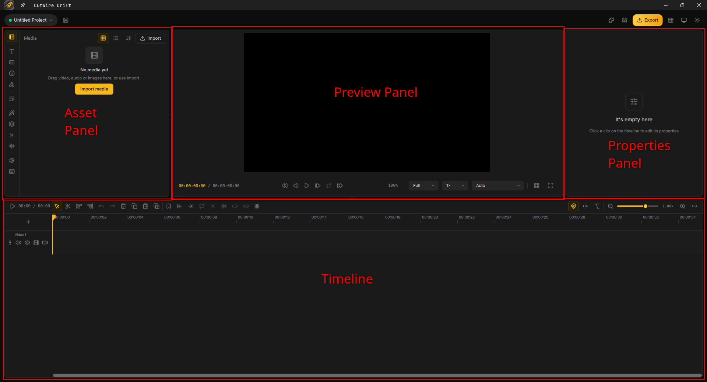

- **Top-left:** The asset panel, where all your available assets live.

- **Top-middle:** The preview panel, where you can preview how your video will look.

- **Top-right:** The properties panel, where you can view and change the selected clip's properties. Nothing is selected right now, so it is empty.

- **Bottom:** The timeline, where you'll put and manipulate all your clips.

## Setup

### Asset

To follow along with the tutorial, [download this screen recording](getting-started-assets/assets/elephant-drawing.mp4)

### Importing the asset into Drift

<table>
  <tr>
    <td style="width: 50%; vertical-align: middle;">
      
If not open already, open the <strong>Media</strong> tab (the filmstrip icon) in the left panel.

      
Click <strong>Import media</strong>, then select the assets you downloaded.

      
Alternatively, you can drag the asset directly into the <strong>Media</strong> panel.

    </td>
    <td style="width: 50%; text-align: center; vertical-align: middle;">
      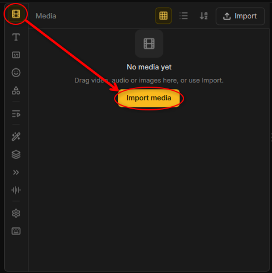
    </td>
  </tr>
</table>

### Putting the video into the timeline

<table>
  <tr>
    <td style="width: 50%; vertical-align: middle;">
      
Drag the 6 minute video from the <strong>Media</strong> panel onto the timeline below.

    </td>
    <td style="width: 50%; text-align: center; vertical-align: middle;">
      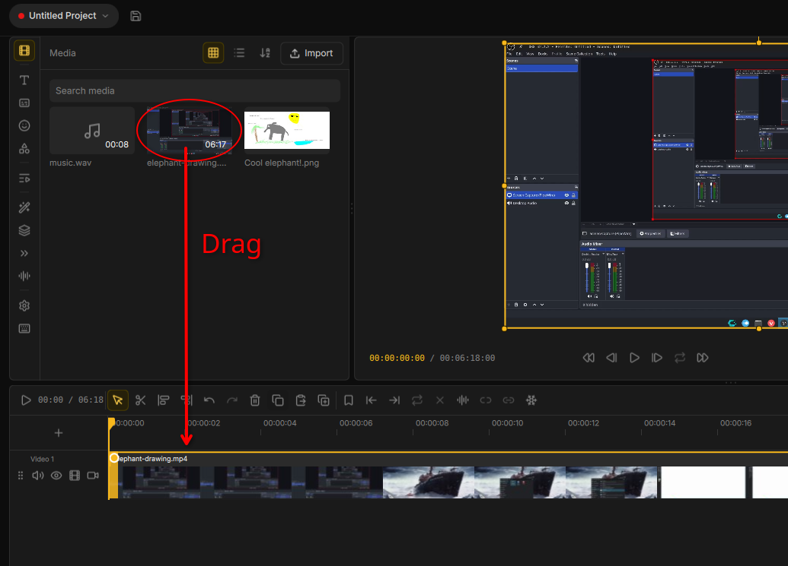
    </td>
  </tr>
</table>

You can also zoom in or out of the timeline via the magnifying glass icons or slider located on the right of timeline toolbar.

    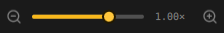

### Adjusting preview quality

If the video preview is slow or stutters, you can decrease the **Preview quality** to improve playback performance. You can find this setting on the preview panel's toolbar. It is set to **Full** by default.

    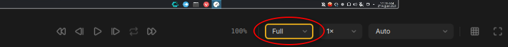

## Editing the video

### Trimming unwanted footage

The screen recording begins with unwanted footage of the user pressing record on OBS and then launching KolourPaint, so let's remove that!

To remove unwanted footage, you should first find where it ends. Move the **playhead** (the orange vertical line) left or right with your cursor to preview the recording. You can also just click on the time display located above the timeline (it looks like **XX:XX:XX**) and the playhead will move there. When you first open the project, the playhead is positioned at the very beginning of the timeline. Just move it a little after you see KolourPaint open.

Now, click **Trim start** (looks like a horizontal bar graph) on the left of the timeline's toolbar.

    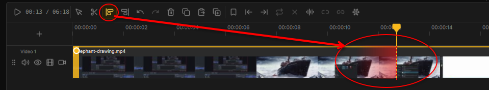

After clicking **Trim start**, hover your cursor over the clip. A dotted line and a red gradient will appear. Move your cursor to where you want the unwanted footage to end. Everything in the direction of the red gradient will be removed.

Be careful not to use **Trim end** instead. **Trim end** removes everything on the right side of the dotted line, while **Trim start** removes everything on the left. Since the unwanted footage is at the beginning of the recording, **Trim start** is the one you want here.

If you make a mistake, you can undo it with `Ctrl-Z` (or click the round arrow pointing left on the timeline toolbar). If you undo something by mistake, you can redo it with `Ctrl-Shift-Z` (or click the round arrow pointing right).

After trimming the start of the footage, repeat the process but use **Trim end** to trim when the user saves the art in KolourPaint. You can use the scroll wheel on your cursor to move the timeline or the scrollbar at the bottom of the timeline. If you use the scroll wheel, your cursor **must be over a clip** to scroll.

Now that you've trimmed both ends of the clip, you should move it back to the beginning of the timeline.

Before moving the clip, switch back to the **Select** tool (the cursor icon). Otherwise, you may accidentally trim the clip again.

Then, click and drag the clip toward the beginning of the timeline. An orange ghost will show where the clip will land. Keep dragging until the ghost starts at the beginning of the timeline. This prevents the exported video from starting with several seconds of black.

### Speeding up the drawing process

The unnecessary footage is gone, but we're still left with almost five minutes of the agonizingly slow process of drawing an elephant. That's a little too long for a TikTok/Short, so let's speed up the drawing process.

<table>
  <tr>
    <td style="width: 50%; vertical-align: middle;">
      
To speed up the footage, first select the clip. The controls for the selected clip will appear in the top-right panel. If the panel says <strong>“It's empty here”</strong>, click the clip and the <strong>General</strong> tab (icon with the <em>i</em> inside a circle) will appear.

  
Click <strong>Speed</strong> (the speedometer icon), then select the playback speed you want. You can choose any speed you like, but for this tutorial, select <strong>4x</strong>. This brings the drawing much closer to the 1 minute target, at around 1 minute and 30 seconds. You'll be able to see the clip getting shorter.

</td>
<td style="width: 50%; text-align: center; vertical-align: middle;">
  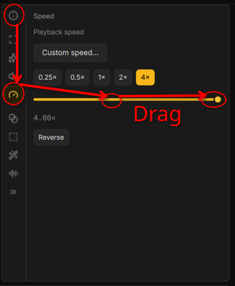
</td>
  </tr>
</table>

### Removing unecessary parts

The drawing is finally moving at a reasonable pace, but there's still some unnecessary footage left. For example, nobody needs to watch somebody undo a mistake, so let's cut those parts out.

For this, you won't use the **Trim** tool, as it is designed to remove footage from the beginning or end of a clip. Instead, you'll use the **Cut mode** tool to separate the parts you want to remove. It's worth learning its shortcut, `B`, which switches to the Cut mode tool, as you'll be using it a lot. Cutting clips is one of the most common tasks in video editing in general.

To use it, you simply cut once at the beginning of the area you want to cut out, then you cut a second time at the end of the area you want to cut out. After that, you simply right click the newly created clip you wanted to cut out and delete.

If the recording is short enough, like this one, it's a good idea to watch the entire thing before making any cuts. This lets you get an idea of which parts you want to remove before you start making the finer edits.

If you're not sure what to remove, look for the parts where the canvas is temporarily filled with a solid color before returning to white. These are good candidates for cutting, as the sudden flashes can be distracting to the viewer.

### Reframing the video

The video is too wide to fit a TikTok or Short, so let's reframe it to make it taller and narrower.

To do this, go to the **Asset Panel** and open **Settings** from its toolbar. At the top of the panel, you'll see **Choose layout...**. Click it, then select **YT Short**. You can also select **TikTok** from the **TikTok** section, but both use the same 9:16 aspect ratio.

The workspace will automatically change to accommodate the new aspect ratio. If you don't like the new workspace layout, click **Workspace: portrait** in the top-right corner and switch from **Auto** to **Landscape**.

  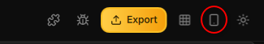

For this guide, we'll switch to **Landscape** to keep the workspace consistent.

After switching layouts, you may notice that the clip no longer fits within the new borders. To fix this, select the clip on the timeline if you haven't already. Eight nodes will appear around the clip; use only the corner nodes to resize it. You can also drag the clip up or down and let it snap to the center.

Your video should currently look something similar to this:

  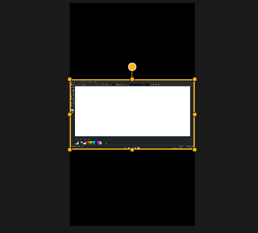

### Adding a background

A black background isn't very appealing, so let's replace it with something better without needing any additional asset.

To do this, it's recommended to create a new track on the timeline. Currently, there is only one track, and that's where your clip resides. In a nutshell, tracks are basically **layers**: clips on higher tracks appear above clips on lower tracks.

To create a track, click **Add new track** at the beginning of the timeline. It's marked with a **+** symbol. Drift will ask you what type of track you want to create; select **Video**, since our background will be a video. Move this new track below the first track containing the clip.

To populate the second track with a clip, select your first clip and click **Duplicate** (the copy icon with an added **+** symbol). Don't panic if you don't see a new clip right away; simply zoom out enough and you'll see a second clip to the **right** of the original. Drag that newly created clip to the beginning of the second track.

The second clip is behind the first clip and is the same size, so the background is still black as expected. To cover the background, select the second clip and resize it using the corner nodes as done before. It's fine if its sides are cut off.

It should now look something like this:

  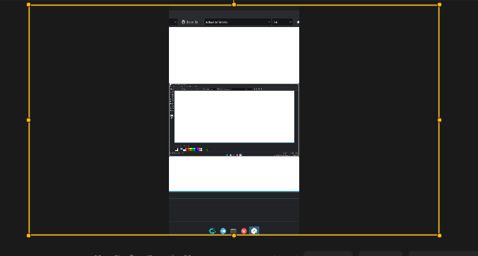

It may be a little hard to see, but the background is simply a duplicate of the foreground expanded to fill the entire frame. To make it easier to focus on the foreground, let's blur the background.

To blur it, select the clip representing the background. Then, in the **Asset Panel**, go to **Effects** (the magic wand icon). Use the search bar to search for **Blur** and **Gaussian Blur (GPU)**, then add both effects. Using both is recommended to achieve a good-quality blur.

To change the parameters of either effect, click **Effects** in the **Properties Panel**. Here, you can change the blur strength to whatever you prefer.

For the setup shown below, **Gaussian Blur (GPU)** is set to `5.1` and **Blur** is set to `8.5`:

  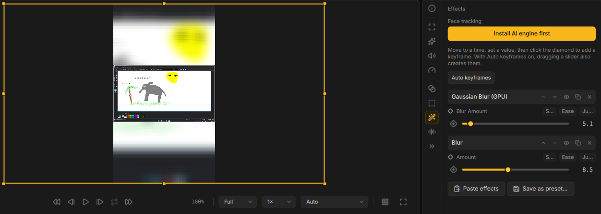

### Adding captions

The video is finally starting to look like a proper TikTok/Short, but there's one problem: without any context, the viewer has no idea what they're watching. Let's add some captions to explain what's happening.

Add a new track as shown before, but this time select **Text** instead of **Video**. Leave the new track at the top so that the text appears in front of everything else.

The track is empty for now, so go to the **Text** menu in the **Asset Panel**. Here, you'll find several built-in text templates. For this guide, I recommend **Sentence background**, as its background makes the text easier to read. You can use any template you prefer, though.

After adding the text, expand the text clip so that it lasts for the entire video.

**Important Note:** Drift v0.4.0 has a bug that may prevent you from expanding a clip while it is selected. To work around this, select another clip or click an empty area of the timeline, then try expanding the text clip again.

The text is empty by default. To give it content, go into the **Properties Panel** and into the **Text** menu. Here, you can change its content, font, size, etc.

### Final step: Exporting

You can add more to the video if you want, but we'll stop here to keep the guide from getting unnecessarily long.

To export, click the big yellow button on the top right corner called **Export**. Then, it'll ask you for certain stuff, but for this, just leave it on its default and click **Export**.

Now you're done! You only need to wait for the export to finish. It could take multiple minutes to finish, that's normal.

[Here's the project if you want to see it](getting-started-assets/assets/elephant-drawing.drift)
